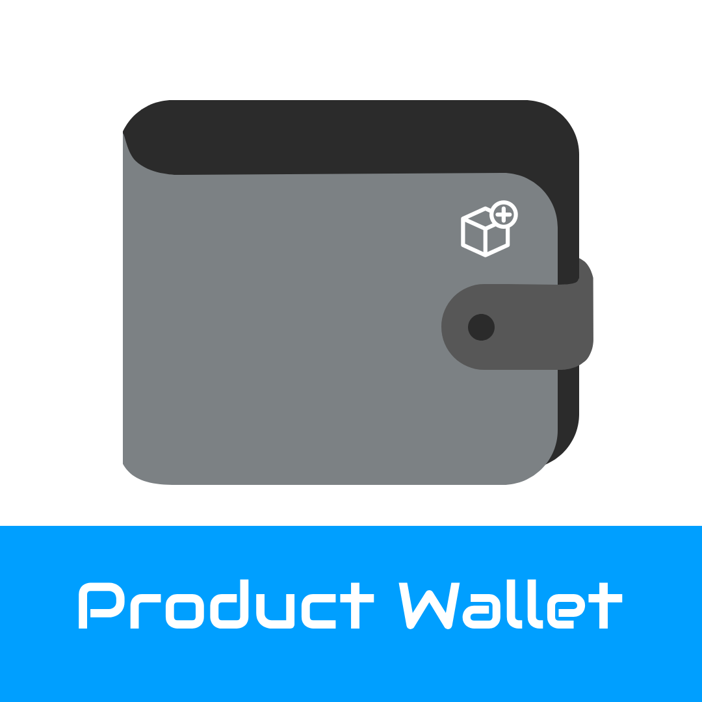
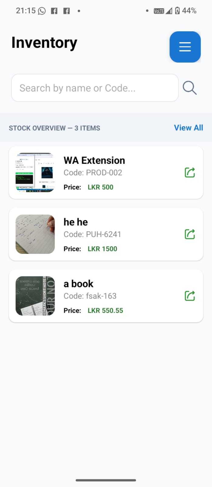
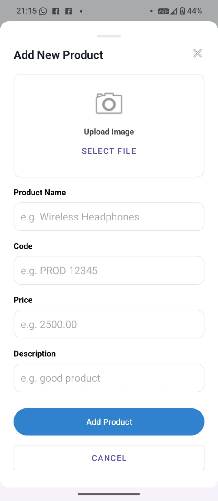
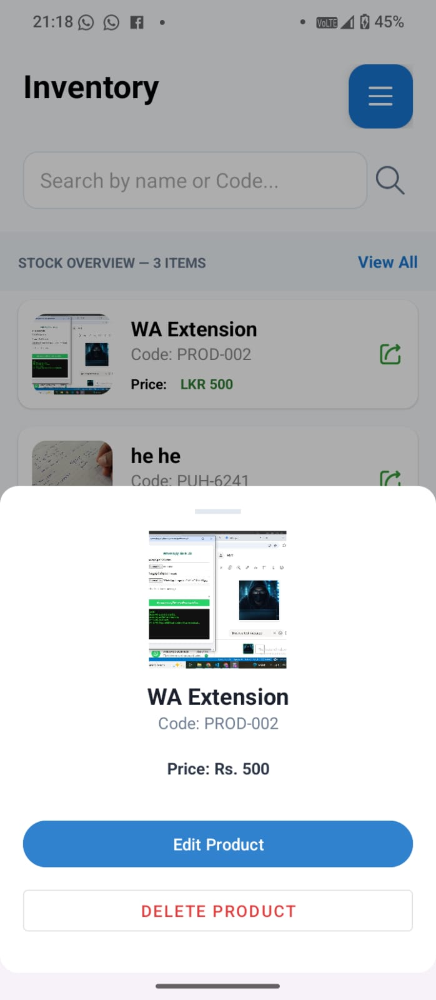

# 📦 Product Wallet -  Your Digital Inventory Companion!

**Product Wallet** යනු ඔබ සතු භාණ්ඩවල විස්තර ඉතාමත් පිරිසිදු සහ සරල අතුරු මුහුණතක් හරහා කළමනාකරණය කිරීමට Rash Gunathilake විසින් නිපදවන ලද Android යෙදුමකි. 

  

## ✨ විශේෂාංග (Features)

- **Store Product Details:** භාණ්ඩයේ නම, කේතය (Code), මිල සහ විස්තර ඉතා පහසුවෙන් ගබඩා කර තබා ගත හැක.
- **Image Support:** සෑම භාණ්ඩයකටම පින්තූරයක් ඇතුළත් කළ හැකි අතර, එය පද්ධතිය තුළම යාවත්කාලීන (Update) කිරීමට හෝ මැකීමට (Delete) හැකියාව ඇත.
- **SQLite Database:** ඔබගේ දත්ත සියල්ල ඔබගේ දුරකථනය තුළම ඇති Local Database එකක ආරක්ෂිතව ගබඩා වේ.
- **Modern UI:** දත්ත ඇතුළත් කිරීමට සහ සංස්කරණය කිරීමට නවීන **BottomSheet** සහ **Material Design** සංකල්ප භාවිතා කර ඇත.
- **Fully Offline:** අන්තර්ජාල පහසුකම් නොමැතිව වුවද සම්පූර්ණ ඇප් එක භාවිතා කළ හැක.

## 🛠️ තාක්ෂණික මෙවලම් (Built With)

- **Java** - Core Programming Language
- **SQLite** - Local Data Storage
- **Material Components** - Professional UI Design

## 📸 Screenshots

  
  
  

## 🚀 ස්ථාපනය කරගන්නා ආකාරය (How to Install)

පහත බොත්තම හරහා ඇප් එකේ නවතම සංස්කරණය (APK) සෘජුවම බාගත කරගත හැක:

1. ඉහත **Download APK** බොත්තම ක්ලික් කරන්න.
2. බාගත කරගත් `.apk` ගොනුව විවෘත කරන්න.
3. අවශ්‍ය නම් 'Install from Unknown Sources' ලබා දී ස්ථාපනය අවසන් කරන්න.

---
**Developed by [Rash Gunathilake](https://github.com/rashgunathilake) - © 2026**

### ❤️ Support My Work

If you like what I do, maybe consider buying me a coffee! ☕

